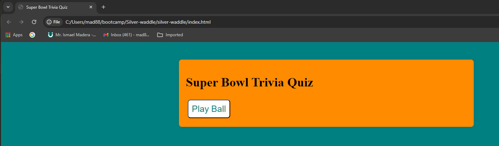
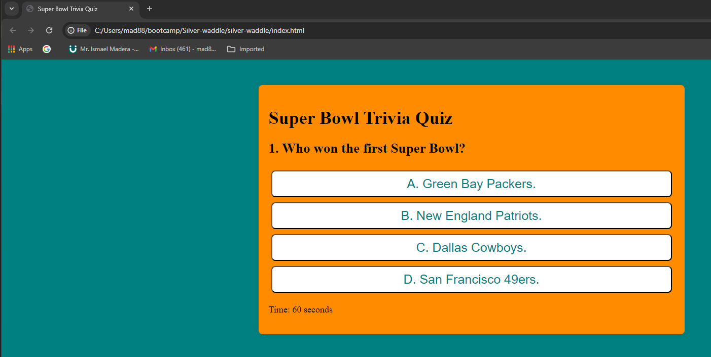
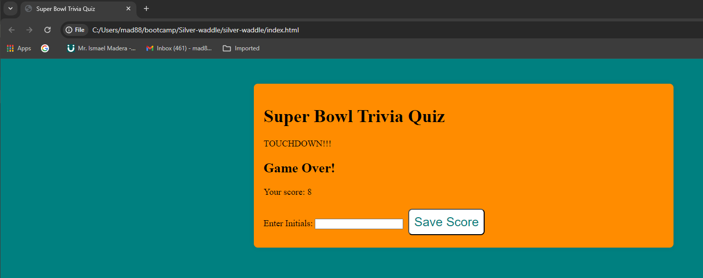

# silver-waddle
## User Story
AS A coding boot camp student
I WANT to take a timed quiz on JavaScript fundamentals that stores high scores
SO THAT I can gauge my progress compared to my peers
## Acceptance Criteria
GIVEN I am taking a code quiz
WHEN I click the start button
THEN a timer starts and I am presented with a question
WHEN I answer a question
THEN I am presented with another question
WHEN I answer a question incorrectly
THEN time is subtracted from the clock
WHEN all questions are answered or the timer reaches 0
THEN the game is over
WHEN the game is over
THEN I can save my initials and score
Mock-Up
The following animation demonstrates the application functionality:Challenge 4 Quiz
## Screenshots

## Resources
JavaScript Reference: https://developer.mozilla.org/en-US/docs/Web/JavaScript/Reference 

addEventListener() method: https://developer.mozilla.org/en-US/docs/Web/API/EventTarget/addEventListener

DOM ContentLoaded Event: https://developer.mozilla.org/en-US/docs/Web/API/Document/DOMContentLoaded_event

Function: https://developer.mozilla.org/en-US/docs/Web/JavaScript/Reference/Global_Objects/Function 

getElementById()method: https://developer.mozilla.org/en-US/docs/Web/API/Document/getElementById

getQuestion: https://reference.learnosity.com/questions-api/methods/questionsApp/question

var: https://developer.mozilla.org/en-US/docs/Web/API/Window/confirm

function: https://developer.mozilla.org/en-US/docs/Web/JavaScript/Reference/Statements/function

Strict Equality: https://developer.mozilla.org/en-US/docs/Web/JavaScript/Reference/Operators/Strict_equality 

Binary Logical Operators  OR - ||: https://developer.mozilla.org/en-US/docs/Web/JavaScript/Reference/Operators/Logical_OR

Strict Equal === : https://developer.mozilla.org/en-US/docs/Web/JavaScript/Reference/Operators/Strict_equality  

setInterval: https://developer.mozilla.org/en-US/docs/Web/API/setInterval

++ Increment: https://developer.mozilla.org/en-US/docs/Web/JavaScript/Reference/Operators/Increment

-- Decrement: https://developer.mozilla.org/en-US/docs/Web/JavaScript/Reference/Operators/Decrement

< less than: https://developer.mozilla.org/en-US/docs/Web/JavaScript/Reference/Operators/Less_than

String.prototyoe.trim(): https://developer.mozilla.org/en-US/docs/Web/JavaScript/Reference/Global_Objects/String/trim

String.prototype.toUpperCase(): https://developer.mozilla.org/en-US/docs/Web/JavaScript/Reference/Global_Objects/String/toUpperCase

alert: https://developer.mozilla.org/en-US/docs/Web/API/Window/alert

Addtion Assignments (+=): https://developer.mozilla.org/en-US/docs/Web/JavaScript/Reference/Operators/Addition_assignment

JSON.parse(): https://developer.mozilla.org/en-US/docs/Web/JavaScript/Reference/Global_Objects/JSON/parse

